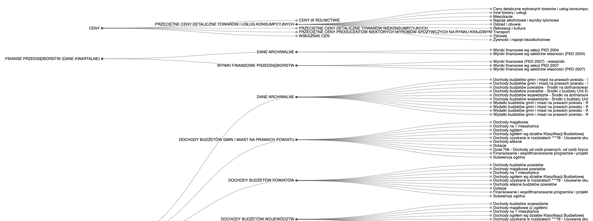

# Preconditions

- golang
- goimports `go install golang.org/x/tools/cmd/goimports@latest`

# GUS BDL

https://api.stat.gov.pl/Home/BdlApi

Gastronomia
https://bdl.stat.gov.pl/api/v1/subjects?format=json&parent-id=G190

https://bdl.stat.gov.pl/api/v1/data/by-variable/1609860?format=json&unit-level=0
# TODO

1. Move limiter as a standalone library
2. Move tree-downloader as a standalone library

# What is it?

It takes data from GUS api, renders it, creates some fancy charts.

